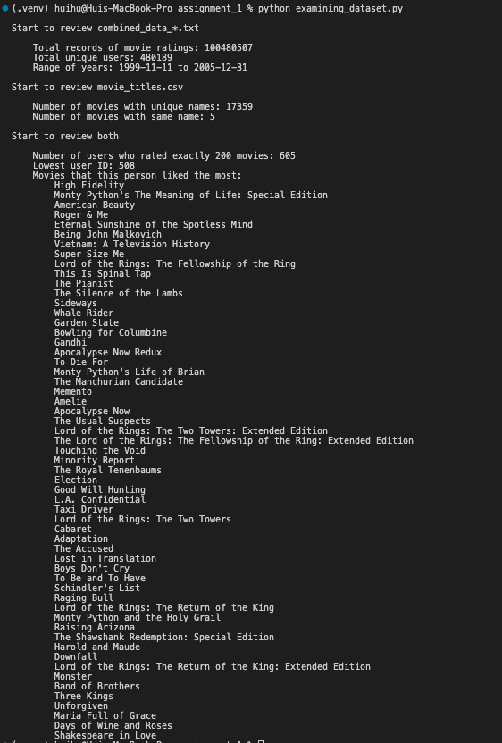

# CS 6220 Data Mining — Assignment 1

**Notion page**: https://hui-hwoo.notion.site/CS-6620-Assignment-1-ce4105de62e8441b88dc7da1415a173c?pvs=4

## How to run

1. get into the directory of the project `cd Assignment/assignment_1`
2. run `python coding_review.py` to run the coding review code
3. run `python examining_dataset.py` to run the examining dataset code

## Results

1. Coding Review

2. Examining Dataset

